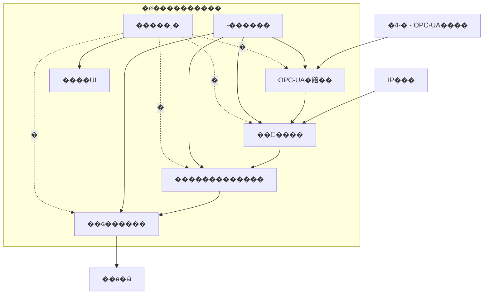

# �ø������������Ư��

## ��

�ø����������o�4�4k-nU���ø��Ȧ���Ф�
g�\W�4-�nOPC-UA���n����K�n �֗��J�s���hn�hj��SY��������gY

## ���Ư��e�

## ������

### 1. -������

-������o�������hSn���Y�-Äj�������gY

**;�_�:**
- �������-�n8�h��
- ����n�����Л
- -�	�n<h�ֳ������xn� 
- UIK�n-����

**�S��ï:**
- ����n-�ա��JSON/YAML	
- -�����<

### 2. OPC-UA�餢��

OPC-UA�餢��o�4-�nOPC-UA����h�Wf-��K��W~Y

**;�_�:**
- OPC-UA����xn��h�<
- -��K���ykMachineryItemState	n�ֹ��׷��
- \b��OutOfService�Kji	n�h�
- ���Kn�h�����ï

**�S��ï:**
- node-opcua ~_o^<nOPC-UA�餢������
- �����Ջ���Ư��

### 3.  ������

 ������o���K�n�Ǫ������֗W����աk<
Łk�Xf ϯ��ג��W~Y

**;�_�:**
- IP���K�nRTSP/RTMP�����֗
- H.264/H.265���ǣ��
- ����ա�-���jB��	
- OPC-UA���k�eO ϯ�����W
- ������xn�����

**�S��ï:**
- GStreamer~_o^<n ������
- Node.jsK�nͤƣ�����|s�W

### 4. �������������

�������������o����աh���ȯ���n�X��SW~Y

**;�_�:**
- ����աnǣ���ϡ
- ���ȯ���n%�Xߡ
- �����(��n�h����
- �D���ȯ���n���ɢ����ɺ��nJdI	

**�S��ï:**
- ա�뷹��API
- ������I/O

### 5. ��ɢ������

��ɢ������o��U�_ ϯ���h�������ɵ�ӹx���k�W~Y

**;�_�:**
- ������h����n��
- ��ɹ����xn�<������
- �����ɶKn�h�fL��ï
- ��������Bn��������

**�S��ï:**
- �������SDKAWS SDKAzure SDKGoogle Cloud SDKI	
- TLS/HTTPS�
- ����

### 6. �����˿�

�����˿�o�������hSneh'��WOLzBk���ȒzW~Y

**;�_�:**
- CPU���ǣ��(��n�
- ���������Kn��
- ����n�K�
- ���h������z�

**�S��ï:**
- ������꯹������
- ����������
- ������˺�

### 7. ����UI

����UIo�ø��Ȧ��k����U�_ǣ���~_o����������L1g-�h�_��ЛW~Y

**;�_�:**
- ����Kn�
- �,-�n	����է��
- :��1nh:
- ����gn������ƣ�/�

**�S��ï:**
- Web������է��Express + ReactI	
- �����÷����

## ������

1. OPC-UA�餢��L-�nOPC-UA����h��W�K	��ֹ���
2. IP���K�n Ϲ����L ������k�cf֗U�����U�_�����աk�X
3. OPC-UA�餢��L-�\b����Y�h ������k�
4.  ������o���B;nM���p-���	n ϻ���Ȓ����աK���
5. ��U�_ ϯ���oOPC-UA����\b1-�IDI	hqk���ȯ���(n�hj�k�X
6. ��ɢ������L�XU�_����h�������Wf���x�
7. �����˿�L����hS��WOLLB�p����UIk���Ȓh:

## �<'�V

1. **\��V**: UPShn#:k���hj�������h����w
2. **���������V**: ����gn���ȭ����h��ީBn�բ�����
3. **������**: ��������աn���j�h���ȯ���(n�wU�_�����
4. **��������**: ����gnij��h�w��˺�

## ����ƣ�V

1. **OPC-UA�**: OPC-UA����ƣ��ա��)(W_�<h��
2. **��������**: ��ƣ����n���X
3. **����**: TLS/SSLk���hj�hij�<
4. **����6�**: ����UIxn����6Ph�<�˺�

## en�5'

1. **�øAI**: �øgn��� ��k��������գ���_�
2. **p�����**: pn�����h��K�n2
3. **�����q**: /�)�ji�n������hnq
4. **�뿤����**: �'�����Bn�뿤�巹��