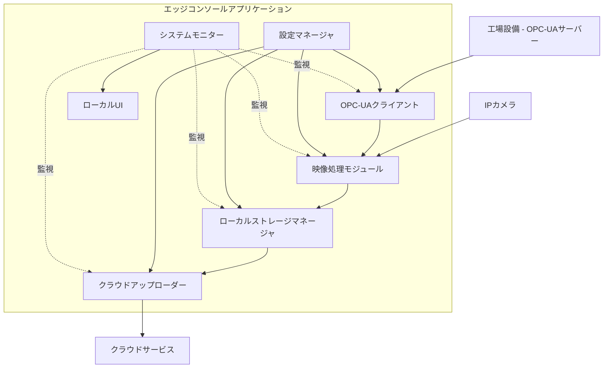

# エッジコンソールアプリケーションアーキテクチャ

## 概要

エッジコンソールアプリケーションは、工場現場に設置されるエッジゲートウェイデバイス上で動作し、工場設備のOPC-UAベースの監視、カメラからの映像取得・処理、およびクラウドとの安全な通信を担当するコンポーネントです。

## アーキテクチャ概略図

## コアモジュール

### 1. 設定マネージャ

設定マネージャは、アプリケーション全体の構成を管理する中心的なコンポーネントです。

**主要機能:**
- アプリケーション設定の永続化と読み込み
- 各モジュールの初期化パラメータ提供
- 設定変更の検証とサブコンポーネントへの反映
- UIからの設定更新処理

**技術スタック:**
- ローカルの設定ファイル（JSON/YAML）
- 設定スキーマ検証

### 2. OPC-UAクライアント

OPC-UAクライアントは、工場設備のOPC-UAサーバーと通信して設備状態を監視します。

**主要機能:**
- OPC-UAサーバーへの接続と認証
- 設備状態ノード（特にMachineryItemState）のサブスクリプション
- 停止信号（OutOfService状態など）の検出と通知
- 接続状態の監視と再接続ロジック

**技術スタック:**
- node-opcua または類似のOPC-UAクライアントライブラリ
- イベント駆動型アーキテクチャ

### 3. 映像処理モジュール

映像処理モジュールは、カメラからのビデオストリームを取得し、循環バッファに格納、必要に応じて映像クリップを抽出します。

**主要機能:**
- IPカメラからのRTSP/RTMPストリーム取得
- H.264/H.265エンコーディング処理
- 循環バッファ管理（設定可能な時間枠）
- OPC-UAトリガーに基づく映像クリップ切り出し
- 抽出クリップへのメタデータ付与

**技術スタック:**
- GStreamerまたは類似の映像処理ライブラリ
- Node.jsからのネイティブモジュール呼び出し

### 4. ローカルストレージマネージャ

ローカルストレージマネージャは、循環バッファとイベントクリップの保存を担当します。

**主要機能:**
- 循環バッファのディスク容量管理
- イベントクリップの個別保存領域管理
- ストレージ使用状況の監視とアラート
- 古いイベントクリップの管理（クラウドアップロード確認後の削除等）

**技術スタック:**
- ファイルシステムAPI
- ストリーミングI/O

### 5. クラウドアップローダー

クラウドアップローダーは、抽出された映像クリップとメタデータをクラウドサービスへセキュアに送信します。

**主要機能:**
- 抽出クリップとメタデータの暗号化
- クラウドストレージへの認証済みアップロード
- アップロード状態の管理と再試行ロジック
- ネットワーク障害時のローカルキューイング

**技術スタック:**
- クラウドプロバイダーSDK（AWS SDK、Azure SDK、Google Cloud SDK等）
- TLS/HTTPS通信
- キュー管理

### 6. システムモニター

システムモニターは、アプリケーション全体の健全性を監視し、問題発生時にアラートを発します。

**主要機能:**
- CPU、メモリ、ディスク使用状況の監視
- ネットワーク接続状態の確認
- 各モジュールの状態監視
- ログ管理と障害アラート発信

**技術スタック:**
- システムメトリクス収集ライブラリ
- ロギングフレームワーク
- アラート通知メカニズム

### 7. ローカルUI

ローカルUIは、エッジゲートウェイに直接接続されたディスプレイまたはローカルネットワーク経由で設定と監視機能を提供します。

**主要機能:**
- システム状態の可視化
- 基本設定の変更インターフェース
- 診断情報の表示
- ローカルでのトラブルシューティング支援

**技術スタック:**
- Webベースインターフェース（Express + React等）
- システムダッシュボード

## データフロー

1. OPC-UAクライアントが設備のOPC-UAサーバーと接続し、状態変化をサブスクライブ
2. IPカメラからの映像ストリームが映像処理モジュールによって取得され、エンコードされた後、循環バッファに保存
3. OPC-UAクライアントが設備停止信号を検知すると、映像処理モジュールに通知
4. 映像処理モジュールは、トリガー時刻の前後指定秒数（設定可能）の映像セグメントを循環バッファから抽出
5. 抽出された映像クリップはOPC-UAメタデータ（停止理由、設備ID等）と共に、イベントクリップ用の安全な領域に保存
6. クラウドアップローダーが保存されたクリップとメタデータを暗号化してクラウドへ送信
7. システムモニターがプロセス全体を監視し、問題があればローカルUIにアラートを表示

## 信頼性対策

1. **停電対策**: UPSとの連携による安全なシャットダウンとデータ保護
2. **ネットワーク障害対策**: ローカルでのイベントキューイングと接続回復時の自動アップロード
3. **ストレージ管理**: サーキュラーバッファの効率的な管理とイベントクリップ用の保護されたストレージ
4. **エラーハンドリング**: 各モジュールでの適切な例外処理と再起動メカニズム

## セキュリティ対策

1. **OPC-UA通信**: OPC-UAセキュリティプロファイルを利用した認証と暗号化
2. **ローカルストレージ**: センシティブデータの暗号化保存
3. **クラウド通信**: TLS/SSLによる安全な通信と適切な認証
4. **アクセス制御**: ローカルUIへのアクセス制限と認証メカニズム

## 将来の拡張性

1. **エッジAI**: エッジでの予備的映像分析によるアップロードフィルタリング機能
2. **複数カメラ対応**: 複数のカメラソースと視点からの同期記録
3. **追加センサー統合**: 振動、温度など他のセンサーデータとの統合
4. **リアルタイムアラート**: 重大イベント検出時のリアルタイム通知システム