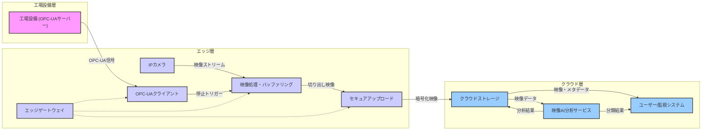

# **工場設備停止時ビデオ記録・分析システム概要設計（報告書に基づく再構成）**

## **1\. はじめに**

本ドキュメントは、先に提示された「工場設備停止時におけるOPC-UAトリガー型ビデオ記録・分析システム概要設計報告書」（以下、原報告書）に基づき、提案システムの概要を再構成したものです。原報告書には、より詳細な技術選定、比較、および検討事項が含まれています。

## **2\. システム概要**

### **2.1. 目的**

工場における設備停止インシデント発生時に、状況証拠となる映像を確実に記録・分析し、原因究明の迅速化、再発防止策の策定支援、および運用監視の高度化を実現する。

### **2.2. コア機能**

* **設備停止信号検知**: OPC-UAプロトコルを介して工場設備からの停止信号をリアルタイムに受信する。  
* **インテリジェントビデオ記録**: 設備周辺を常時撮影しているカメラ映像から、停止信号の前後指定秒数を自動的に切り出して保存する。  
* **セキュアなクラウド保管**: 切り出された映像クリップを、関連メタデータ（タイムスタンプ、設備ID、OPC-UA情報等）と共にクラウドストレージへ安全にアップロードし、保管する。  
* **AIによる自動分類**: クラウド上でAIを活用し、保管された映像を分析して内容に基づき自動的に分類する。

### **2.3. 期待される効果**

* 設備停止時の詳細な状況把握と迅速な原因特定。  
* 再発防止策の精度向上。  
* 運用監視の効率化と高度化。  
* 生産性向上と安全性確保への貢献。

## **3\. システムアーキテクチャ**

### **3.1. 全体構成**

本システムは、大きく分けて「工場設備層」「エッジ層」「クラウド層」の3層で構成される。

### **3.2. 主要コンポーネントと役割**

* **工場設備 (OPC-UAサーバー搭載)**: 監視対象。稼働状況データ（特に停止信号）をOPC-UA経由で発信する。  
* **エッジゲートウェイ**:  
  * **IPカメラ**: 設備周辺を常時撮影。解像度、低照度性能、耐環境性、H.265圧縮対応などを考慮して選定。  
  * **OPC-UAクライアント**: 工場設備のOPC-UAサーバーに接続し、設備停止信号（例: PackMLのMachineStopReason）を監視・受信する。  
  * **映像処理・バッファリング (GStreamer等)**: カメラ映像を常時循環バッファに記録。停止信号受信時に、トリガー時刻の前後指定秒数の映像をH.265形式等で切り出す。  
  * **セキュアアップロードモジュール**: 切り出された映像クリップと関連メタデータを暗号化し、クラウドへ安全に送信する。  
* **クラウドプラットフォーム**:  
  * **オブジェクトストレージ (AWS S3, Azure Blob Storage, Google Cloud Storage等)**: 暗号化された映像クリップとメタデータをスケーラブルかつ安全に保管。ライフサイクル管理によりコスト最適化。  
  * **映像AIサービス (Amazon Rekognition, Azure Video Indexer/AI Vision, Google Cloud Video Intelligence等)**: 保管された映像を分析。物体検出、シーン検出、アクティビティ検出等の汎用機能に加え、工場特有の事象を認識するためのカスタムAIモデルをトレーニング・活用し、自動分類を行う。

### **3.3. データフロー概要**

1. IPカメラからエッジゲートウェイへ常時映像がストリーミングされる。  
2. エッジゲートウェイは映像を循環バッファに記録し続ける（古いデータから上書き）。  
3. 工場設備はOPC-UAサーバー経由で稼働状態を送信。  
4. エッジゲートウェイのOPC-UAクライアントが設備停止信号を検知。  
5. 検知時刻を基に、循環バッファから該当する前後数秒の映像クリップを抽出。  
6. 抽出された映像クリップと関連メタデータ（設備ID、タイムスタンプ、OPC-UA情報等）がクラウドストレージへセキュアにアップロードされる。  
7. クラウドストレージへの新規オブジェクトをトリガーとして、映像AIサービスがクリップを分析・分類する。  
8. 分類結果はメタデータとして映像に紐づけられ、ユーザーによるレビューや他システムでの活用に供される。

## **4\. 主要技術要素**

* **映像取得・記録**:  
  * **カメラ**: 産業環境に適したIPカメラ（H.265対応推奨）。  
  * **映像処理**: GStreamerフレームワークを活用し、柔軟なパイプラインで映像のキャプチャ、エンコード、循環バッファリング、クリッピングを実現。  
  * **エンコーディング**: H.265 (HEVC) を採用し、高画質を維持しつつストレージと帯域幅を効率化。  
* **設備停止検知**:  
  * **OPC-UA**: 標準化された産業用通信プロトコル。  
  * **情報モデル**: 「OPC UA for Machinery」のMachineryItemState（特にOutOfService状態）など、標準化された情報モデルの活用を推奨し、多様な設備との連携性を高める。サブスクリプション方式による状態変化の即時検知が望ましい。  
* **クラウド連携**:  
  * **アップロード**: HTTPS等のセキュアなプロトコルとTLS/SSL暗号化を使用。エッジデバイスの認証を確実に行う。  
  * **ストレージ**: スケーラビリティ、耐久性、セキュリティ、AIサービスとの統合性、コストを考慮して選定（詳細は原報告書の比較表参照）。  
* **映像AI分析**:  
  * **クラウドAIサービス**: 主要クラウドプロバイダーのサービスを活用。  
  * **カスタムモデル**: 工場特有の故障モードやイベントを認識するため、収集した映像データを用いてカスタム分類モデルをトレーニング（AutoMLツールの活用）。継続的なモデルの評価と再トレーニング（MLOps）が重要。

## **5\. 重要検討事項**

* **セキュリティ**:  
  * **OPC-UA**: 認証、暗号化等のセキュリティ機能を活用。  
  * **エッジゲートウェイ**: OS堅牢化、ファイルシステム暗号化、アクセス制御。  
  * **データ転送**: TLS/SSLによる暗号化。  
  * **クラウド**: 保存データ暗号化、IAM等による厳格なアクセス制御。  
  * エンドツーエンドでの多層防御アプローチと、認証情報管理の徹底。  
* **信頼性と可用性**:  
  * **電源障害**: エッジゲートウェイとカメラにUPSを設置し、安全なシャットダウンとデータ保護を実現。  
  * **ストレージ管理**: 循環バッファの上書きポリシー、イベントクリップ用個別ストレージの容量管理と満杯時ポリシーの策定。ストレージ健全性の監視。  
  * **ネットワーク障害**: クラウド接続断時もエッジでの記録・検知を継続し、接続回復後に自動アップロードするキューイング機構。  
* **スケーラビリティと保守性**:  
  * **スケーラビリティ**: カメラ台数、データ量増加に対応できるエッジ処理能力、ネットワーク帯域、クラウド資源。  
  * **保守性**: エッジソフトウェアの安全な更新メカニズム、OPC-UA設定の容易性、AIモデルの再トレーニングとデプロイプロセスの確立（MLOps）、システム全体の包括的な監視とアラート。  
* **コスト**:  
  * エッジハードウェア、ソフトウェアライセンス。  
  * クラウドストレージ（容量、階層、転送量）、AIサービス利用料（処理時間、APIコール数）。  
  * 運用コスト（ネットワーク、メンテナンス、データラベリング等）。  
  * ストレージライフサイクル管理やAI分析対象の最適化によるコスト効率化。

## **6\. 結論と次のステップ**

本概要設計は、原報告書で詳述された内容に基づき、工場設備停止時の映像記録・分析システムのコア機能とアーキテクチャを提示するものです。OPC-UAによるトリガー、エッジでのインテリジェントなビデオクリッピング、クラウドでのセキュアな保管とAI分析を組み合わせることで、工場の運用効率と安全性の向上に貢献します。

**推奨される次のステップ:**

1. **パイロット導入**: 小規模な範囲でシステムを試験導入し、実環境での課題特定と設計検証を行う。  
2. **コア機能確立**: OPC-UA連携、正確なビデオクリッピング、信頼性の高いクラウドアップロード機能の確立に注力する。  
3. **AI活用評価**: クラウドAIサービスの事前学習済みモデルで基本機能を評価後、工場固有の事象に対応するカスタムAIモデルを段階的に開発・改良する。

本システムの成功には、セキュリティ設計の徹底、エッジデバイスの信頼性確保、そして継続的なAIモデルの改善が不可欠です。詳細については、原報告書をご参照ください。